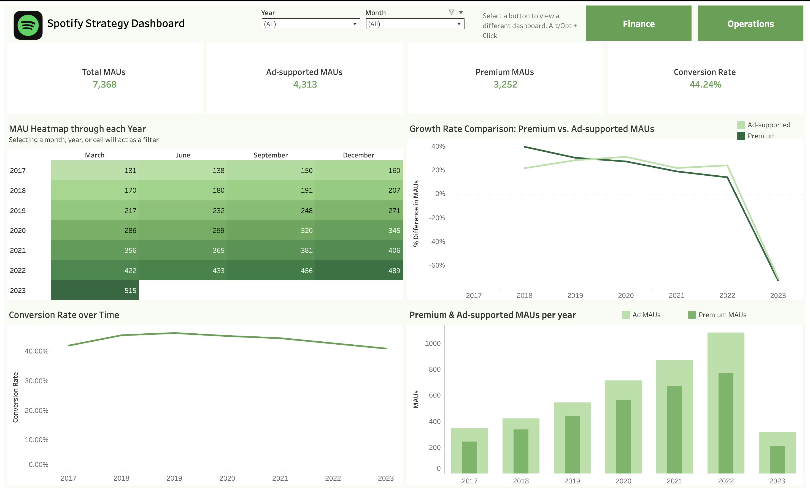

# 📊 Spotify Performance Analysis Project

**Role:** Data Analyst & BI Developer  
**Tools Used:** Tableau, Google Sheets

---

## 🎯 Overview

As a BI Analyst at Spotify, this project focuses on transforming financial and user engagement data into actionable insights for three key stakeholders:  
- **Sarah (Head of Strategy)**  
- **Mark (Director of Revenue)**  
- **Olivia (VP of Operations)**

The end goal is to build a stakeholder-specific Tableau dashboard that provides deep insight into user growth, revenue streams, and cost structure.

---

## 🧠 Problem Statement

Spotify stakeholders needs to understand:
- **User trends** (Premium vs. Ad-supported)
- **Revenue breakdown** and ARPU trends
- **Operational cost efficiency** across R&D, marketing, and revenue costs

---

## 📌 Project Objectives

Each stakeholder had different goals and required tailored KPIs:

### 👩 Sarah – Head of Strategy
**Goal:** Understand user growth trends  
**KPIs:**
- Monthly Active Users (MAUs)
- % Growth in Premium and Ad-supported users
- Market share by user type

### 👨 Mark – Director of Revenue
**Goal:** Optimize and understand revenue sources  
**KPIs:**
- Revenue by stream (Premium vs. Ad-supported)
- Premium ARPU over time
- Year-over-year revenue growth

### 👩‍💼 Olivia – VP of Operations
**Goal:** Improve cost efficiency  
**KPIs:**
- Cost of Revenue trends
- Operational Costs over time
- Cost-to-Revenue Ratio

---

## 📅 Project Plan

This project was split into **two main phases**:

### Phase 1 – Planning & Exploration:
- Explored and cleaned the dataset
- Identified key metrics and stakeholder needs
- Defined project goals and KPIs

📄 [View full project plan](01_Planning/spotify_project_plan.pdf)

### Phase 2 – Analysis & Visualization:
- Built Tableau dashboard based on KPIs
- Summarized findings and takeaways in a report

---

## 📊 Dataset

The dataset contains Spotify's financial and user metrics from March 2017 - March 2023, including:
- Monthly Active Users (Premium & Ad-supported)
- Total Revenue & Revenue by Stream
- ARPU (Average Revenue Per User)
- Cost of Revenue, R&D, and Marketing Expenses

🗂️ [View Dataset](02_Data/spotify_data.csv)

I calculated the following columns in the dataset:
- Premium Revenue Share
- Premium Profit Margin
- Ad Revenue Share
- Ad Profit Margin
- Ad ARPU
- Conversion Rate
- Operational Efficiency Ratio

---

## 📊 Tableau Dashboard

Interactive dashboard hosted on Tableau Public:  
🔗 [View the dashboard](https://public.tableau.com/views/SpotifyDashboardProject_17432915912560/Operations?:language=en-US&:sid=&:redirect=auth&:display_count=n&:origin=viz_share_link)

---

## ✅ Key Takeaways

- Premium users are the primary revenue driver, but ad-supported growth is rising
- ARPU has declined slightly, suggesting market saturation or pricing pressure
- R&D spend is growing, but marketing can be optimized for efficiency

📄 [View Closing Report](https://www.notion.so/Spotify-Closing-Report-23b52541c16580018461ca322eae3b96?source=copy_link)
